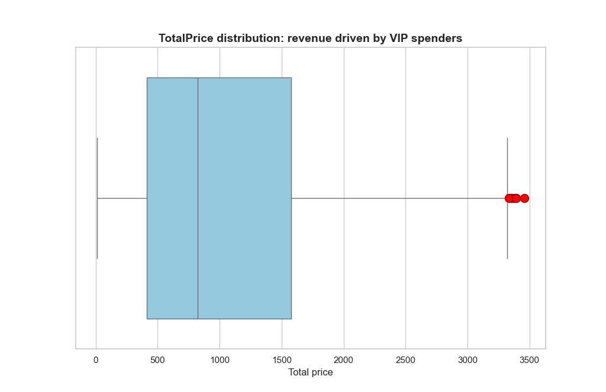
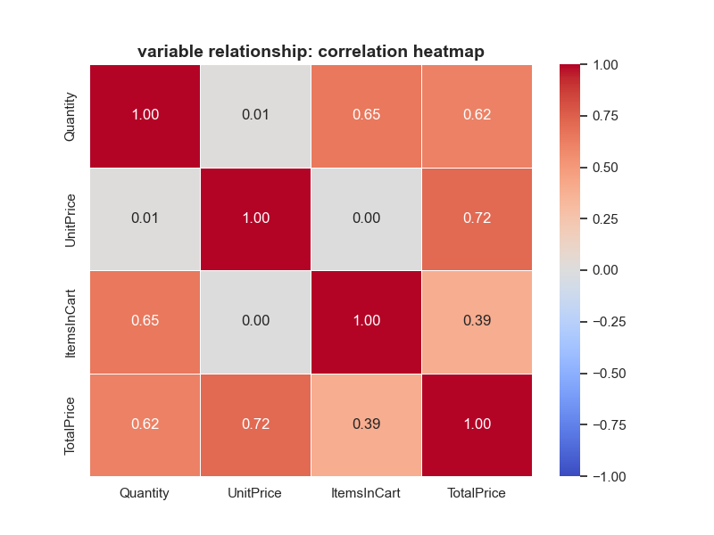

# Exploratory Data Analysis: Sales Insights

## 1. Problem Statement
The objective of this exploratory data analysis is to interrogate the sales dataset to uncover underlying purchasing trends, understand variable distributions, and identify extreme customer behaviors (VIPs) prior to predictive modeling.

## 2. Methodology
Data was pre-processed from project-1 to resolve structural formatting errors. For the forensics phase, distributions were analyzed to determine the correct outlier detection frameworks. The Z-Score method was applied to symmetrically distributed variables, while the robust IQR method was deployed to handle the heavily right-skewed `TotalPrice` variable.

## 3. Key Findings

* **Distributions:** Standard variables are normally distributed with zero extreme outliers. The rating scale exhibits a slight left-skew due to a cluster of lower-end values.
* **The VIP Signal:** The `TotalPrice` variable is heavily right-skewed. The IQR analysis successfully isolated a specific group of extreme outliers representing high-value VIP spenders.

* **Variable Relationships:** Correlation analysis (Pearson r) revealed that Unit Price is the strongest predictor of Total Price (r=0.72). Interestingly, there is zero correlation (r=0.00) between Unit Price and Items In Cart, indicating that item price does not deter customers from adding multiple items to their cart.

## 4. Recommendations
* Develop a targeted VIP loyalty program for the extreme high-spenders identified in the TotalPrice outlier analysis.
* Since cart size is entirely unaffected by the price of the items, marketing should confidently test cross-selling premium items alongside standard items without fear of reducing overall cart volume.